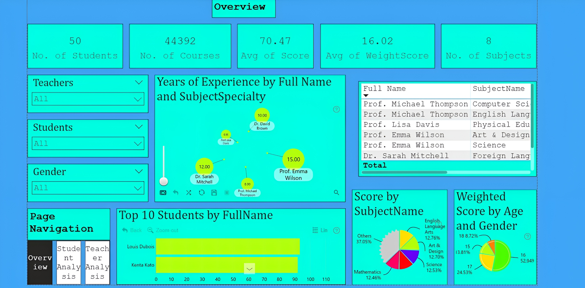
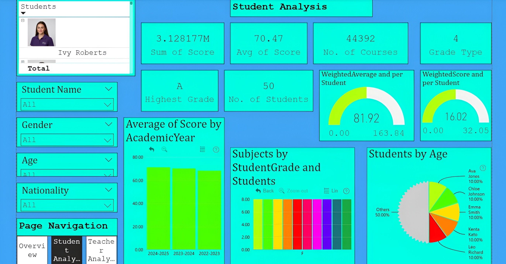
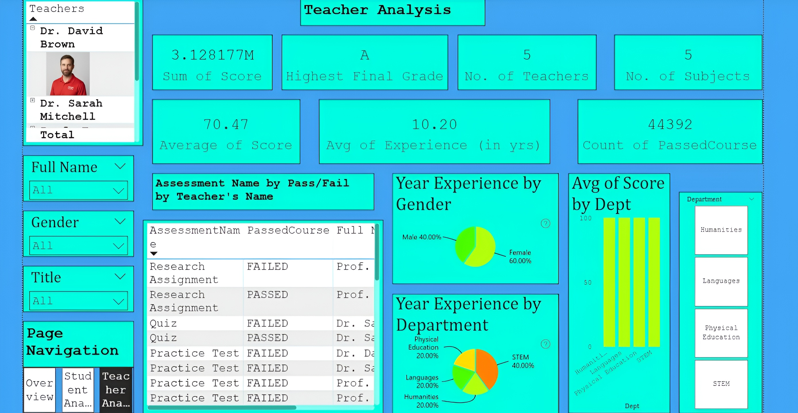

# Zoomcharts-FP20-Analytics-Challenge-31-Student-Performance-Report

# 📊 FP20 Analytics Challenge 31 – Student Performance Analysis  
**ZoomCharts Submission | Power BI Report by Gyanankur Baruah**

---

## 🧠 Challenge Overview  
This report was created for the **FP20 Analytics Challenge 31**, focused on analyzing student performance data across subjects, assessments, and academic years. Built using **Power BI** and enhanced with **ZoomCharts Drill Down Visuals**, the report enables intuitive exploration of learning trends, disparities, and top achievers.

Participants were asked to uncover insights that could help educators, institutions, and policymakers improve teaching effectiveness and student outcomes.

---

## 📁 File Structure  
- `Zoomcharts October Challenge FP20.pbix` – Power BI report file  
- `FP20 Analytics Challenge 31.pdf` – PDF version of the report  
- `1000099075-Picsart-AiImageEnhancer.jpg` – Page 1: Overview  
- `1000099076-Picsart-AiImageEnhancer.jpg` – Page 2: Student Analysis  
- `1000099077-Picsart-AiImageEnhancer.jpg` – Page 3: Teacher Analysis  

---

## 📄 Report Pages

### 🔹 Page 1: Overview  

- Total Students: 44,392  
- Average Score: 70.47  
- Top 10 Students by Score  
- Score Distribution by Subject  
- Weighted Score by Age and Gender  
- Teacher Experience by Subject Specialty

This page provides a high-level summary of student and teacher metrics, enabling quick identification of performance hotspots and demographic trends.

---

### 🔹 Page 2: Student Analysis  

- Filters by Student Name, Grade, Age, Academic Year  
- Average Score and Weighted Averages  
- Score Trends Over Time  
- Subject-wise Performance  
- Age Distribution of Students

This page allows drill-down into individual student journeys, helping track progress, identify learning gaps, and highlight top performers.

---

### 🔹 Page 3: Teacher Analysis  

- Department-wise Teacher Performance  
- Assessment Pass/Fail Trends  
- Experience Distribution by Gender and Department  
- Average Score by Department  
- Teacher Count and Assessment Metrics

This page evaluates teaching effectiveness across departments, highlighting areas of strength and opportunities for support.

---

## 📌 Key Insights Uncovered  
- Monthly trends in assessment scores  
- Pass rate changes over time  
- Subject-wise score comparison  
- Top 3 students by weighted average  
- Grade distribution and most frequent grade  
- Teacher impact on student scores  
- Failure patterns by subject and assessment type  
- Frequency of perfect scores  
- Individual student progress tracking  
- Subjects with consistent below-average scores

---

## ✅ Technical Details  
- Report built in Power BI  
- Includes 2 ZoomCharts Drill Down Visuals  
- Canvas size: 1920x1080 (Full HD)  
- Report length: 3 pages  
- Submission deadline: 27 October 2025, 23:59 UK time

---

## 📣 Conclusion  
This report was created to support data-driven decisions in education. By combining interactive visuals with deep analysis, it aims to make student performance data more accessible, actionable, and impactful.

**Made by:** Gyanankur23  
**LinkedIn:** [Follow me here](https://www.linkedin.com/in/gyanankur-baruah-797205338?utm_source=share&utm_campaign=share_via&utm_content=profile&utm_medium=android_app)

---

## 📥 Coming Soon  
Once validated by ZoomCharts, the **Publish to Web** link will be added here for full report access.